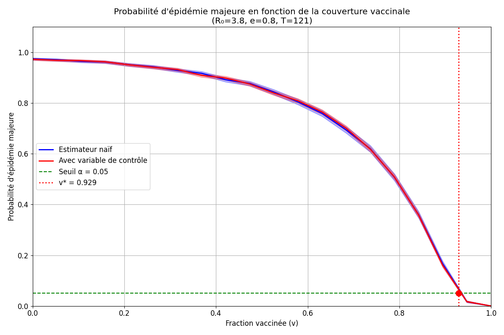
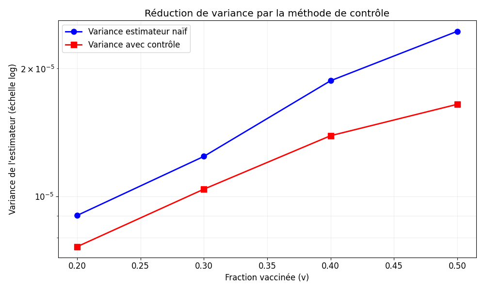

# Estimation de la couverture vaccinale minimale par méthodes Monte Carlo : Application à une maladie de type COVID-19

## Introduction

Dans un contexte où la vaccination fait face à un scepticisme croissant, ce projet vise à calculer la proportion minimale d'une population à vacciner afin d'atteindre une immunité collective, c'est-à-dire la proportion de la population qui doit être vaccinée pour qu'il n'y ait plus de risque d'épidémie. En utilisant deux méthodes de Monte Carlo, à savoir une méthode naïve et une méthode de variable de contrôle, nous estimons la probabilité qu'une maladie dépasse son seuil épidémique sachant le taux de couverture vaccinale. 

Nous considérons une maladie présentant des caractéristiques épidémiologiques similaires au COVID-19, avec un nombre de reproduction de base $R_0 = 3.8$, une efficacité vaccinale $e = 0.8$ et un seuil épidémique $T = 121$. Ces valeurs, bien que simplifiées, permettent d'illustrer les principes fondamentaux tout en restant ancrées dans la réalité épidémiologique contemporaine.

## Modélisation

### Hypothèses

- Population homogène et bien mélangée de taille $N$
- Vaccination aléatoire d'une fraction $v \in [0,1]$ de la population
- Efficacité vaccinale constante $e \in [0,1]$
- Transmission modélisée par un processus de branchement de Galton-Watson

### Notations

- $R_0$ : nombre de reproduction de base (nombre moyen de cas secondaires par cas infectieux en population naïve)
- $v$ : fraction de la population vaccinée
- $e$ : efficacité du vaccin
- $T$ : seuil définissant une épidémie majeure
- $\alpha$ : risque maximal acceptable d'épidémie majeure

### Nombre de reproduction effectif

En présence de vaccination, le nombre de reproduction effectif s'écrit :

$$R_{\text{eff}}(v) = R_0(1 - ve)$$

Cette formule traduit la réduction de transmission due à la fraction $ve$ de la population effectivement protégée.

### Définition d'une épidémie majeure

Nous définissons une épidémie majeure comme un événement où le nombre total de cas dépasse un seuil épidémique $T$. La probabilité d'une telle épidémie, conditionnellement au taux de vaccination $v$, est notée :

$$p(v) = \mathbb{P}[\text{nombre total de cas} \geq T \mid \text{fraction vaccinée} = v]$$

### Processus de branchement épidémique

#### Description du processus

Un processus de branchement de Galton-Watson modélise la propagation génération par génération. Soit $X_{n,j} \sim \text{Poisson}(R_{\text{eff}})$ un processus aléatoire suivant une loi de Poisson de paramètre $R_{\text{eff}}$, représentant le nombre de cas générés par le $j$-ème individu de la génération $n$.

Soit alors $(Z_n)$ le processus défini par :
- $Z_0 = 1$
- $Z_{n+1} = \sum_{j=1}^{Z_n} X_{n,j}$

$Z_n$ représente ainsi le nombre de cas actifs à la génération $n$. Ce processus peut prendre deux trajectoires :

- **Extinction** : $\exists n$ tel que $Z_n = 0$ (plus de cas actifs)
- **Épidémie majeure** : Le nombre total de cas $S = \sum_{k=0}^{\infty} Z_k \geq T$

#### Simulation d'une trajectoire épidémique

Pour simuler une trajectoire du processus $(Z_n)$, nous suivons l'algorithme :

```
Algorithme : Simulation d'une trajectoire
1. Initialiser : génération_courante = 1, total_cas = 1
2. I₁ = 0, I₂ = 0, num_génération = 0
3. Tant que (génération_courante > 0) ET (total_cas < T) :
   4. nouvelles_infections = 0
   5. Pour chaque individu dans génération_courante :
      6. Tirer k ~ Poisson(R_eff)
      7. nouvelles_infections += k
   8. Si num_génération = 0 : I₁ = nouvelles_infections
   9. Si num_génération = 1 : I₂ = nouvelles_infections
   10. génération_courante = nouvelles_infections
   11. total_cas += nouvelles_infections
   12. num_génération += 1
13. Si total_cas ≥ T : Y_i = 1 (épidémie majeure)
14. Sinon : Y_i = 0 (extinction)
15. Retourner (Y_i, I₁, I₂)
```

où :
- $I_1$ : nombre exact de cas secondaires issus du patient zéro
- $I_2$ : nombre total de cas en 2ème génération (somme des cas générés par tous les infectés de génération 1)
- $Y_i$ : indicatrice de l'événement "la trajectoire $i$ conduit à une épidémie majeure"

### Estimation Monte Carlo naïve

Pour estimer $p(v)$, nous simulons $M$ trajectoires indépendantes :

$$\hat{p}_{\text{naïf}}(v) = \frac{1}{M} \sum_{i=1}^{M} Y_i$$

où chaque $Y_i \in \{0,1\}$ est obtenu par l'algorithme ci-dessus. C'est l'estimateur de Monte Carlo classique, et il vérifie les propriétés suivantes :

- $\mathbb{E}[\hat{p}_{\text{naïf}}(v)] = p(v)$
- $\text{Var}[\hat{p}_{\text{naïf}}(v)] = \frac{p(v)(1-p(v))}{M}$
- Intervalle de confiance à 95% : $\hat{p} \pm 1.96\sqrt{\frac{\hat{p}(1-\hat{p})}{M}}$

### Réduction de variance par variable de contrôle

#### Choix de la variable de contrôle

Nous utilisons $h = I_1 + I_2$ comme variable de contrôle car :
- $h$ est fortement corrélée avec $Y$ (plus les premières générations sont grandes, plus le risque d'épidémie est élevé)
- $\mathbb{E}[h]$ est calculable analytiquement
- $h$ est observable sans coût computationnel supplémentaire

#### Calcul de l'espérance théorique de h

Pour $I_1$ : Le patient zéro génère un nombre de cas suivant Poisson($R_{\text{eff}}$), donc :
$$\mathbb{E}[I_1] = R_{\text{eff}}$$

Pour $I_2$ : Chaque individu de la génération 1 génère des cas selon Poisson($R_{\text{eff}}$). On a :
$$\mathbb{E}[I_2] = \mathbb{E}[\mathbb{E}[I_2 \mid I_1]] = \mathbb{E}[I_1 \cdot R_{\text{eff}}] = R_{\text{eff}} \cdot \mathbb{E}[I_1] = R_{\text{eff}}^2$$

Donc :
$$\mathbb{E}[h] = \mathbb{E}[I_1 + I_2] = R_{\text{eff}} + R_{\text{eff}}^2$$

#### Construction de l'estimateur avec variable de contrôle

Pour chaque trajectoire $i$, nous obtenons le triplet $(Y_i, I_{1,i}, I_{2,i})$ et calculons $h_i = I_{1,i} + I_{2,i}$.

**Étape 1 : Estimation du coefficient optimal**

$$\hat{b} = \frac{\sum_{i=1}^M (Y_i - \bar{Y})(h_i - \bar{h})}{\sum_{i=1}^M (h_i - \bar{h})^2}$$

où $\bar{Y} = \frac{1}{M}\sum Y_i$ et $\bar{h} = \frac{1}{M}\sum h_i$.

**Étape 2 : Construction de l'estimateur corrigé**

$$\hat{p}_{\text{VC}}(v) = \frac{1}{M} \sum_{i=1}^{M} \left[ Y_i - \hat{b}(h_i - \mathbb{E}[h]) \right]$$

avec $\mathbb{E}[h] = R_{\text{eff}} + R_{\text{eff}}^2$.

### Algorithme de recherche de $v^*$

Pour trouver la couverture minimale $v^*$ telle que $p(v^*) \leq \alpha$, nous utilisons une recherche dichotomique :

```
Algorithme : Recherche de v*
Entrées : R₀, e, α, T, M, tolérance ε
Sorties : v*, p(v*)

1. v_min ← 0, v_max ← 1
2. Tant que |v_max - v_min| > ε :
   3. v_mid ← (v_min + v_max) / 2
   4. p_mid ← EstimerProbabilité(v_mid, M)
   5. Si p_mid > α :
      v_min ← v_mid
   6. Sinon :
      v_max ← v_mid
7. v* ← (v_min + v_max) / 2
8. Retourner v*, p(v*)
```

Le nombre de personnes à vacciner est alors :
$$N_{\text{vac}} = \lceil v^* \times N \rceil$$

## Résultats

### Paramètres de l'étude

- $R_0 = 3.8$ (nombre de reproduction de base)
- $e = 0.8$ (efficacité vaccinale de 80%)
- $\alpha = 0.05$ (risque maximal de 5%)
- $T = 121$ (seuil d'épidémie majeure)
- $N = 100000$ (population de 100 000 individus)
- $M = 10000$ (nombre de simulations)

### Estimation de la couverture minimale

**Résultat principal** : La recherche dichotomique converge vers :

- $v^* = 0.929$ (92.9%)
- $N_{\text{vac}} = 92900$ personnes sur 100 000
- Probabilité d'épidémie à $v^*$ : $p(v^*) \approx 0.05$

Ce résultat montre qu'il faut vacciner près de 93% de la population pour maintenir le risque d'épidémie majeure en dessous de 5%.



### Analyse de la courbe $p(v)$

La figure 1 illustre la probabilité d'épidémie majeure en fonction du taux de vaccination :

**Caractéristiques de la courbe p(v)** :
- $v \in [0, 0.2]$ : $p(v) \approx 0.97$ (plateau élevé, quasi-certitude d'épidémie)
- $v \in [0.2, 0.6]$ : décroissance progressive
- $v \in [0.6, 0.92]$ : décroissance rapide
- $v = v^* = 0.929$ : passage sous le seuil $\alpha = 0.05$
- $v > 0.93$ : $p(v) < 0.05$ (risque acceptable)

La courbe montre que l'estimateur naïf et l'estimateur avec variable de contrôle donnent des résultats très proches, avec des intervalles de confiance qui se chevauchent largement.

### Comparaison des méthodes d'estimation

La figure 2 montre la réduction de variance obtenue par la méthode de contrôle pour différentes valeurs de $v$ :



La réduction de variance augmente avec $v$, car la corrélation entre l'occurrence d'épidémie et les premières générations devient plus forte. L'efficacité relative de la méthode de contrôle est donc meilleure pour des taux de vaccination intermédiaires.

### Comparaison avec l'immunité collective théorique

 Le seuil théorique d'immunité collective est :
   $$v_c = \frac{1 - 1/R_0}{e} = \frac{1 - 1/3.8}{0.8} \approx 0.92$$
Notre estimation $v^* = 0.929$ est donc cohérente avec cette valeur théorique.

Les résultats soulignent l'importance d'atteindre des taux de vaccination très élevés (>90%) pour des maladies hautement transmissibles comme le COVID-19, surtout lorsque l'efficacité vaccinale n'est pas parfaite.